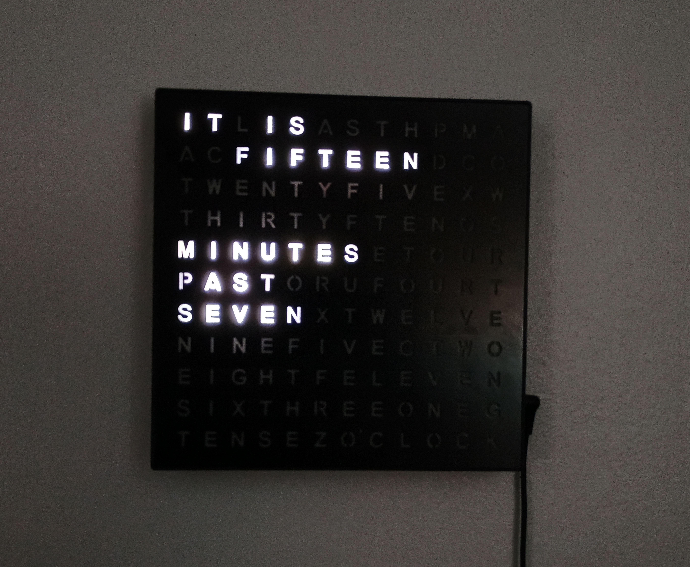

# Word Clock for Fabrica-IO
## Description
This device provides an interface for a word clock using a strip of [Neopixel](https://github.com/adafruit/Adafruit_NeoPixel) compatible LEDs. The clock will display the time in five-minute increments. This features automatic time setting via NTP (through the Fabrica-IO platform), controllable colors for the display, and automatic brightness adjustment for the display.

## Dependencies
This clock depends on the [NexoPixelsController](https://github.com/FabricaIO/actor-NeoPixelsController) and [GenericAalogInput](https://github.com/FabricaIO/sensor-GenericAnalogInput) (if using a photoresistor for brightness control) Fabrica-IO devices, which must also be added to the Fabrica-IO project (see [below](#software-setup)).

## Constructor
The constructor takes three parameters:
* `name`: The name of the device (standard for actors)
* `LEDCount`: An integer for the total number of LEDs in the clock face
* `configFile`: An optional name for the file to store the configuration in

## Actions
This device has the following actions available to it:
| Action ID | Action name   | Action Payload | Return Value              | Description                                   |
| --------- | ------------- | -------------- | ------------------------- | --------------------------------------------- |
| 0         | update        | Any string     | JSON `success` as boolean | Updates the clock to display the current time |

## Configuration
Once a device hub is set up, these are the configuration parameters that can be set in the web interface:
* `Name`: The name of this device.
* `NeoPixel_Controller`: The Neopixel controller device used for the clock display.
* `Brightness_Parameter`: The light sensor (if any) used to control the display brightness.
* `AutoBrightness`: Enable automatic brightness control of the display.
* `brightnessMin`: The dimmest the display is allowed to go. This is a value between 0 and 1 if using AutoBrightness.
* `sensorMax`: The maximum light sensor value expected if using AutoBrightness. Any value above this will set brightness to maximum.
* `sensorMin`: The minimum light sensor value expected if using AutoBrightness. Any value below this will set brightness to `brightnessMin`.
* `sensorSmoothing`: How many sensor values to average together as a rolling average. Enter `0` to disable.
* `color`: The color value of the display, formatted as three or four bytes in the `R,G,B` or `R,G,B,W` format. E.g. `145,76,46`.
* `TaskName`: The name of the clock task. Default is `Clock`.
* `taskPeriod`: An integer number of milliseconds for the period of how often the task runs (e.g. 1000 would be once a second). This is how often the display updates with the current time.

## Making the Project
### Major Materials
1. This project is meant to work with [this clock](https://www.amazon.com/Sharper-Electronic-Contemporary-Housewarming-Decoration/dp/B07NXWXQYH?), any color would work., including [these ones](https://www.amazon.com/Sharper-Image-Electronic-Display-Contemporary/dp/B07CD7S9PZ).
2. An [ESP32-S3 Zero](https://www.aliexpress.us/item/3256806984814685.html) (the C3 version can also work by modifying the pins and the board used by the project in the Fabrica-IO app).
3. Neopixel compatible LED strip, such as a WS2812 or SK6812 strip.
4. 3D printed [back plate](Clock-Insert-LED-Back.stl), can also be copied and remixed from [here](https://cad.onshape.com/documents/ec21d4738a26e97d46042a97/w/c5252cd16a113019a0dc78d1/e/b8a84b6399ae58831cb00727) (this is a work in progress, the screw holes don't quite line up still). 
5. Optional: You may need to purchase or 3D print diffusers. I found that using a thick rectangle of white filament with a gyroid infill of 30-60% works well. You'll need one properly sized to fit each word segment. I've included an [example](Diffuser.stl) of diffusers that can be placed with the curved side facing the front of the clock. They can still use refining.
6. Optional: A light sensor such as a [photoresistor](https://www.amazon.com/DIYables-Photocell-Photoresistor-Arduino-Raspberry/dp/B0CM5YNGSF).

> [!WARNING]
> This is currently only setup to work with an LED strip that has 60 LEDs/m, and therefore is 70-LEDs total for the display. If using an LED strip with a different number of LEDs in each word segment, the code in the [LED range maps](src/WordClock.h#L58) will need to be adjusted.

### Hardware Setup
Take apart the clock and remove the circuit board. You can desolder the barrel jack from the included circuit board. Cut and solder all the LEDs together to fit the spaces in the LED insert.

<table>
  <tr>
    <td></td>
    <td></td>
  </tr>
</table>

Solder the ESP32 to a protoboard with the barrel jack connecting the center positive pin to the 5V pin on the ESP32 and to the power pin on the LED strip. Connect the LED strip data pin to pin 3 on the ESP32 (or any other suitable pin), and connect all the grounds together. If using a phtoresistor, create a voltage divider with a 10KΩ resistor, and connect the divider to a suitable analog input pin such as `2` for the ESP32-S3 Zero. For an example of wiring this up, see this [lightness sensor](https://makeabilitylab.github.io/physcomp/sensors/photoresistors.html#using-photoresistors-with-microcontrollers) configuration. Use `3.3V` for Vin.

Drill a small hole in the top of the top of the case for the photoresistor and glue it in place. Insert the LED display into the clock, and screw it in place.

Program the ESP32 with the Fabrica-IO platform (see [below](#software-setup)) before final assembly.

Line up the assembly so that the barrel jack fits in the appropriate hole in the side of the case (you may need to trim off some of the plastic supports to make everything fit). Hot glue can be used to secure the protoboard assembly in place. Screw the clock back together and hang it on the wall or place it wherever. It should be able to use the included power adapter.

### Software Setup

1. Follow the [Fabirca-IO guide](https://github.com/FabricaIO/FabricaIO-App/wiki/App-Usage#using-the-fabrica-io-app) for installing and setting up the Fabrica-IO app.
2. Copy the [WordClock.json](WordClock.json) file to the project directory and then load the project in the app.
3. Adjust the `NeoPixels` constructor to set the correct `RGB_Type`. For example, if using standard WS2812 LEDs use `NEO_GRB + NEO_KHZ800`, for SK6812 LEDs use `NEO_GRBW + NEO_KHZ800`. See [here](https://github.com/adafruit/Adafruit_NeoPixel/blob/master/Adafruit_NeoPixel.h#L86) for all the options.
4. Adjust the other device constructors as needed, to set the correct pins if changed.
3. Compile and flash the program using the Fabrica-IO app.
6. See [this guide](https://github.com/FabricaIO/FabricaIO-esp32hub/wiki/WiFi-and-Web-Interface#connecting-to-wifi) for connecting to, and setting up, the default web interface on the ESP32.
7. Adjust the configuration through the web interface:
    1. In the `Hub Configuration` check `tasksEnabled` and adjust the `period` (which is in milliseconds) as needed. Good starting values are `5000` if not using a light sensor, or `300` or less if using a light sensor.
    2. Also in `Hub Configuration`, adjust `gmtOffset` (in seconds) and `daylightOffset` (in seconds) to match your timezone GMT offset (standard time) and the offset for daylight savings time (e.g. `3600` for an hour time change) in your area.
    3. Also in `Hub Configuration`, set `ntpUpdatePeriod` (in minutes) to something reasonable like `30`.
    4. Go the the `Device Manager` section of the web interface and adjust the parameters there as needed. It's especially important to set the `Clock` parameters, as by default the light sensor and Neopixel controller to use won't be configured.

> [!NOTE]
> Sane defaults for the configuration that work with SK6812 LEDs and a photoresistor are included as an example in [example.json](example.json), which can be restored as a backup in the web interface `Storage Manager`.